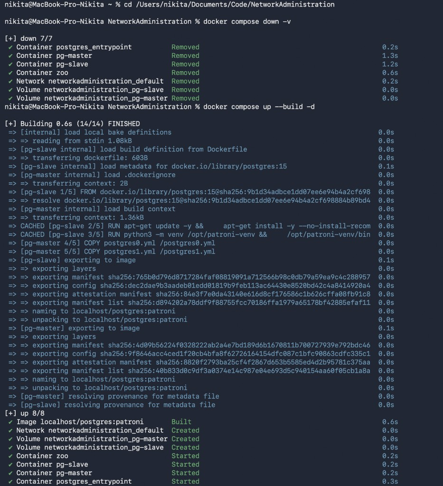
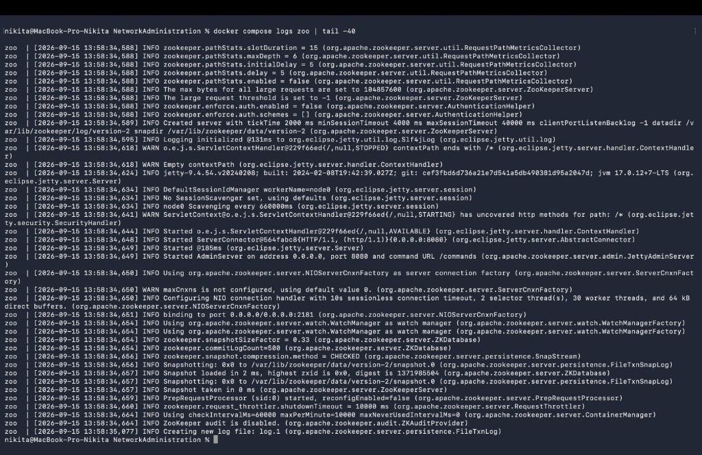
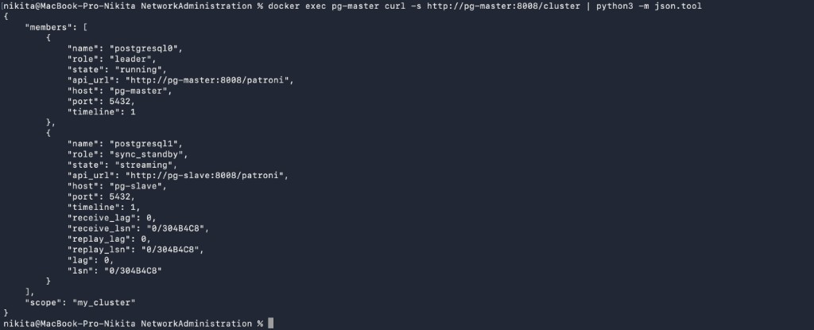
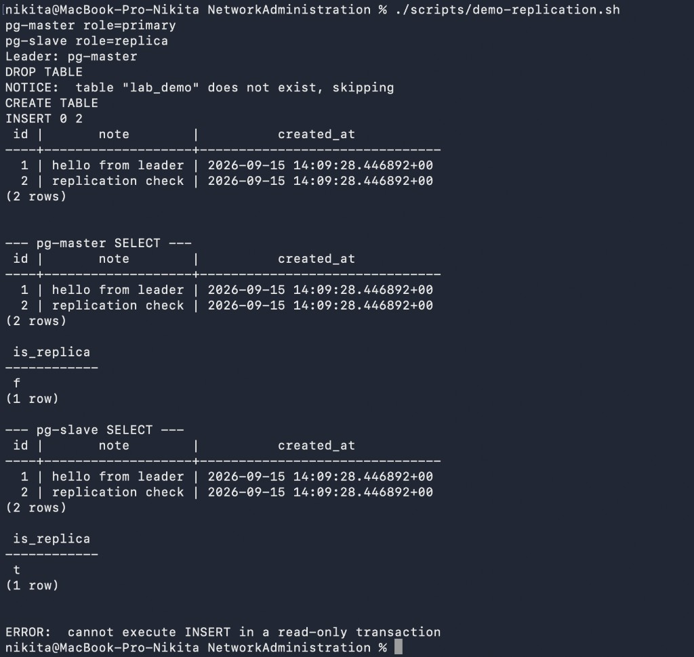
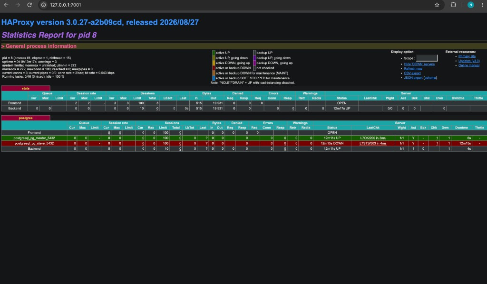
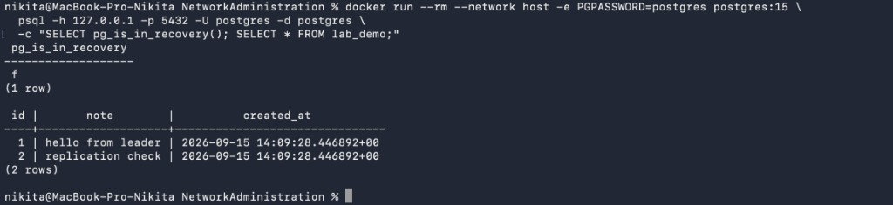
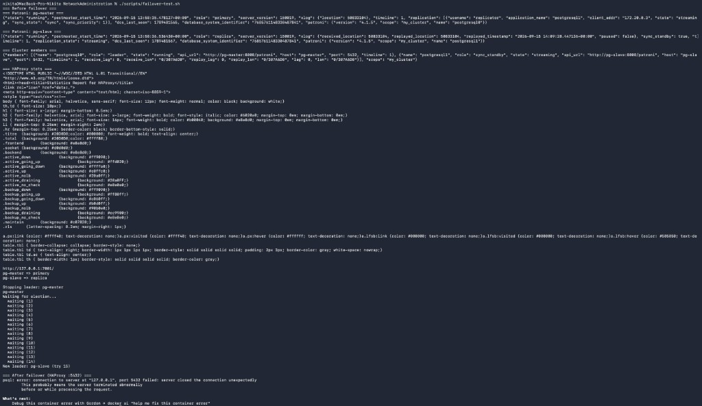
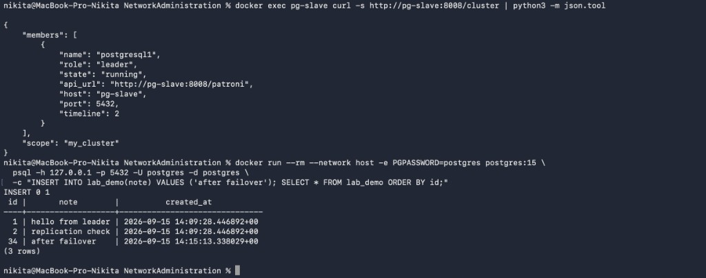
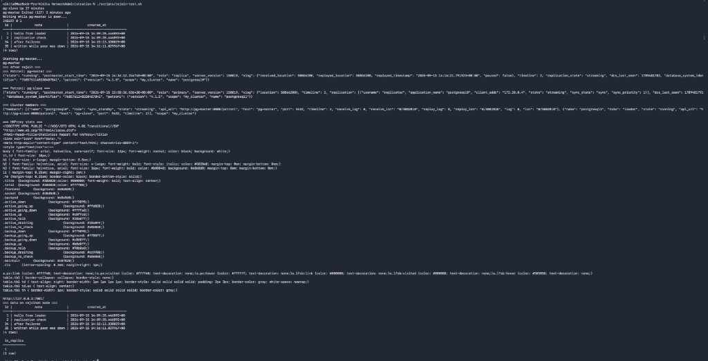

# ЛР: HA Postgres Cluster

## Запуск

Из корня репозитория:

```bash
cd lab1
docker compose down -v
docker compose up --build -d
docker compose logs -f pg-master pg-slave zoo haproxy
```



| Куда | Адрес | Логин |
|------|--------|--------|
| Нода 1 | `127.0.0.1:5433` | `postgres` / `postgres` |
| Нода 2 | `127.0.0.1:5434` | то же |
| Через HAProxy | `127.0.0.1:5432` | то же |
| Stats HAProxy | http://127.0.0.1:7001/ | — |

Лидер может оказаться не `pg-master`, потому что так и задумано у Patroni.

```bash
docker exec pg-master curl -s http://pg-master:8008/cluster
docker compose down -v   
```

---

## Часть 1. Подъём кластера

Образ: `Dockerfile` (Postgres 15 + Patroni).  
Сервисы: `docker-compose.yml` - `pg-master`, `pg-slave`, `zoo`.  
Конфиги нод: `postgres0.yml`, `postgres1.yml`.

Проверка: ZooKeeper без ошибок; в `/cluster` одна нода - `leader`, вторая — `replica` / `sync_standby`.





---

## Часть 2. Репликация

Подключение к обеим нодам. На лидере `CREATE TABLE` и `INSERT`.  
На replica те же данные; запись (`INSERT`/`DELETE`) — отказ (`read-only`).

```bash
./scripts/demo-replication.sh
```



---

## Часть 3. HAProxy

Сервис `haproxy` в compose, конфиг `haproxy.cfg`.  
Клиент ходит на `:5432`, а трафик уходит на текущий primary (healthcheck на `:8008`).  
На stats replica часто красная (`503`), так как check пускает только primary.





---

## Задания в конце файла

### A. Failover

`docker stop` текущей leader-ноды, потом через 15–40 сек вторая становится primary, потом через HAProxy `:5432` снова можно писать.

```bash
./scripts/failover-test.sh
```

ZooKeeper держит lock лидера. После падения ноды TTL истекает, живая нода забирает lock и делает promote. HAProxy перестаёт видеть старый backend и шлёт трафик на новый primary.





### B. Rejoin

Пока нода выключена, мы пишем новые строки через HAProxy.  
После `docker start` она поднимается как replica и догоняет WAL (`use_pg_rewind` и replication slots в конфигах).

```bash
./scripts/rejoin-test.sh
```



---

## Ответы на вопросы

Чем `expose` отличается от `ports`? 
`expose` - когда порт виден только внутри docker-сети compose. `ports` — это ещё проброс на хост. Порт из `ports` для соседних контейнеров тоже доступен.

Пересоберётся ли образ при обычном restart? А если поменять postgresX.yml и Dockerfile?  
Обычный `up` или restart образ не пересобирает.  
Правка `Dockerfile` или `postgres0/1.yml` (лежат в образе через `COPY`), а потом нужен `docker compose up --build`.  
Правка `haproxy.cfg`, потом будет достаточно сделать `restart haproxy`.
