# ЛР: Loki + Zabbix + Grafana

## Запуск

```bash
cd lab2
docker compose up -d
```

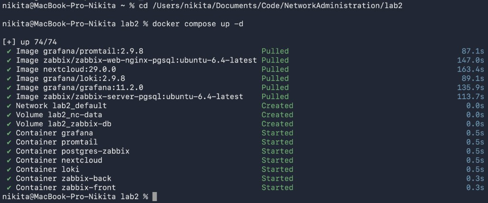

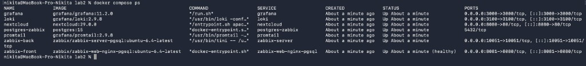

| Куда | Адрес | Логин |
|------|--------|--------|
| Nextcloud | http://127.0.0.1:8080 | создать при первом входе |
| Zabbix | http://127.0.0.1:8081 | `Admin` / `zabbix` |
| Grafana | http://127.0.0.1:3000 | `admin` / `admin` |

```bash
docker compose down -v
```

---

## Часть 1. Логирование

Файлы: `docker-compose.yml`, `promtail_config.yml`.

Nextcloud, логи в data, Promtail читает лог:

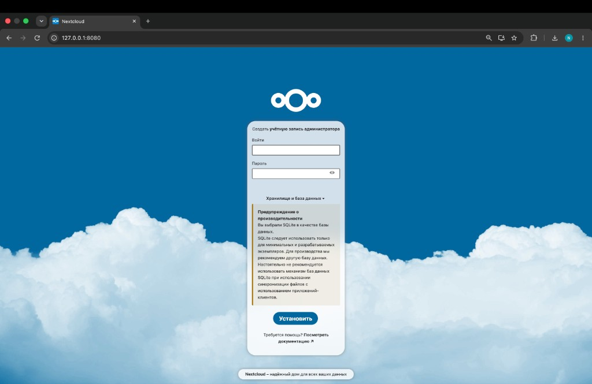

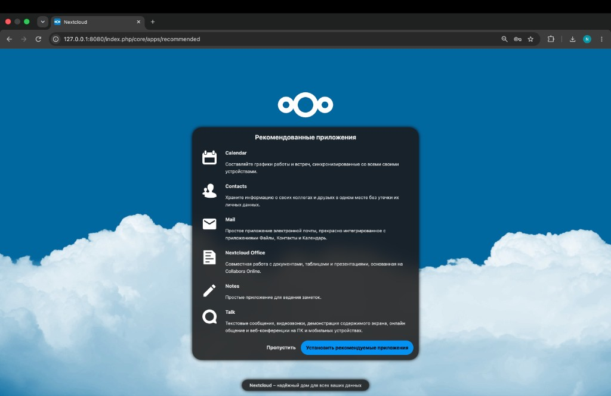

```bash
docker logs promtail --tail 50
```

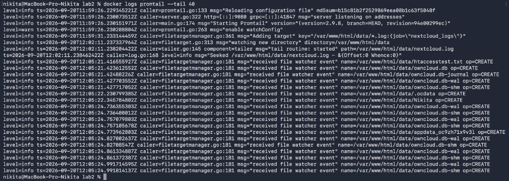

---

## Часть 2. Мониторинг

Import `template.yml` (Data collection, Templates).

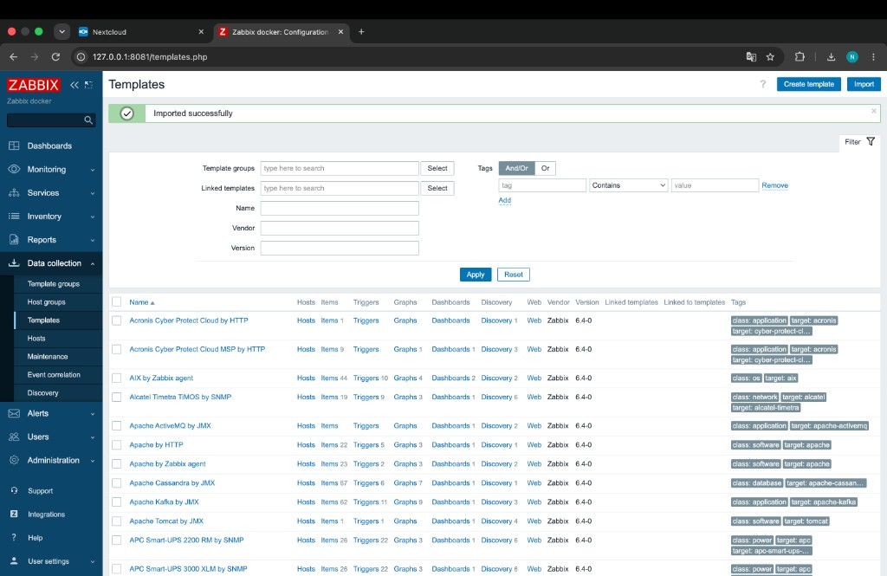

```bash
docker exec -u www-data nextcloud php occ config:system:set trusted_domains 1 --value=nextcloud
```

Host `nextcloud` + шаблон `Test ping template`. Latest data `healthy`:

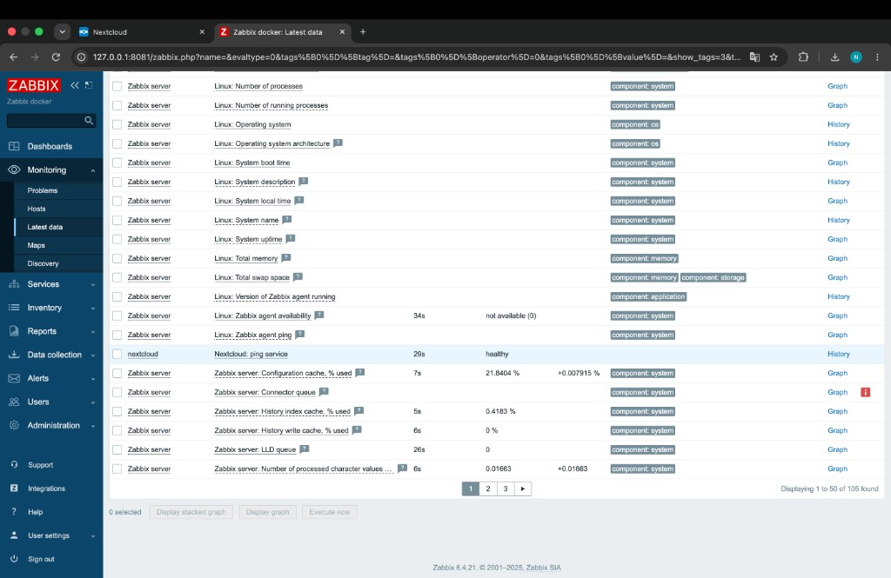

Триггер (Problems):

```bash
docker exec -u www-data nextcloud php occ maintenance:mode --on
curl -s http://127.0.0.1:8080/status.php
docker exec -u www-data nextcloud php occ maintenance:mode --off
```

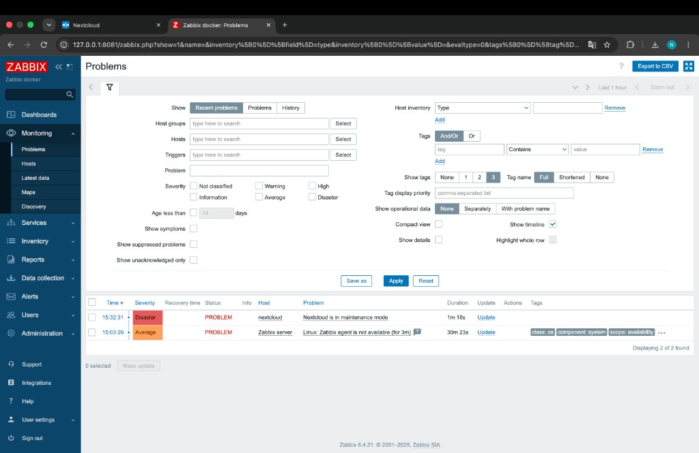

---

## Часть 3. Визуализация

```bash
docker exec grafana grafana-cli plugins install alexanderzobnin-zabbix-app
docker restart grafana
```

Enable плагин Zabbix:

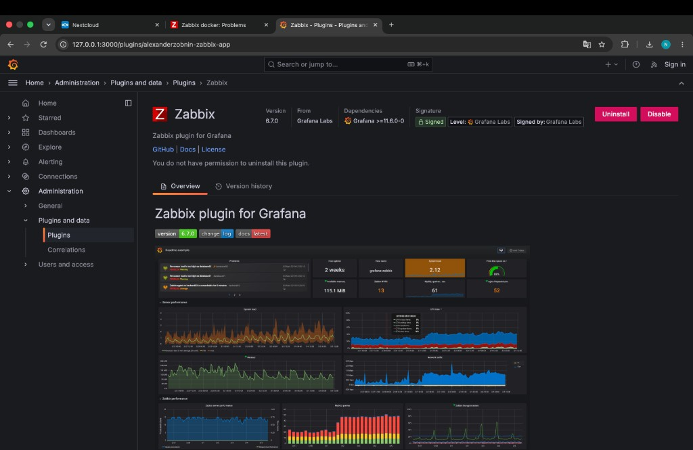

Datasources: Loki `http://loki:3100`, Zabbix `http://zabbix-front:8080/api_jsonrpc.php` (`Admin` / `zabbix`).

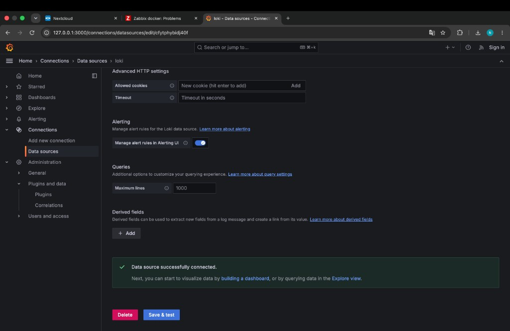

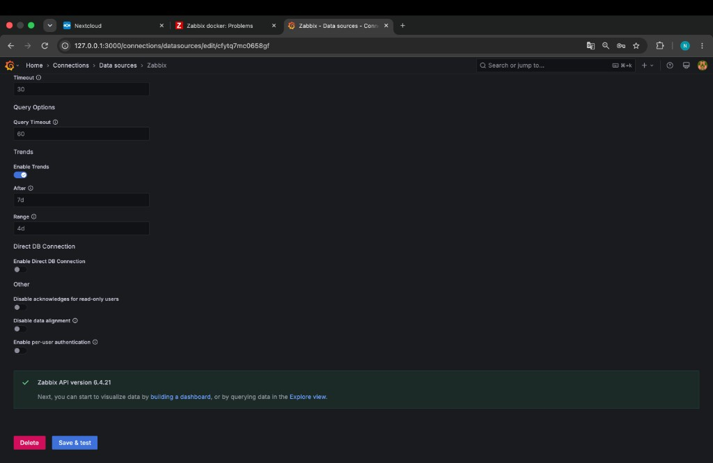

Дашборд: Stat (статус Nextcloud из Zabbix), таблица логов Loki:

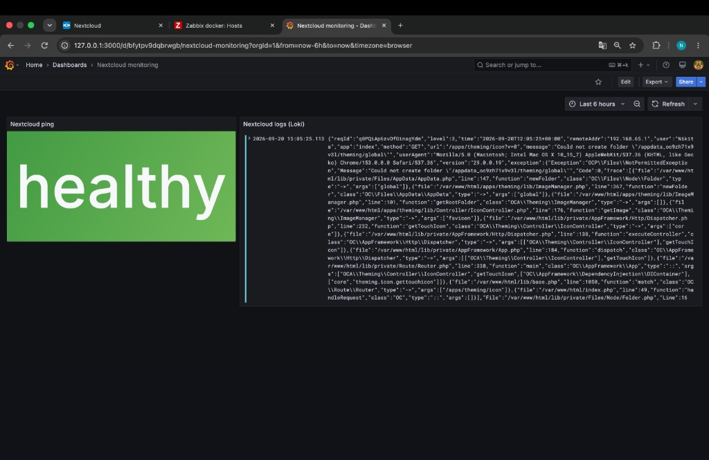

---

## Ответы на вопросы

Чем SLO отличается от SLA?  
SLO это внутренняя цель по качеству сервиса. SLA это договор с клиентом об уровне сервиса и ответственности при нарушении.

Чем incremental backup отличается от differential?  
Incremental это только изменения с последнего бэкапа. Differential это изменения с последнего полного. Восстановление: полный и цепочка инкрементов, либо полный и один дифференциальный.

Чем monitoring отличается от observability?  
Monitoring это контроль заранее выбранных метрик и алертов. Observability это возможность понять состояние системы по logs, metrics, traces, в том числе при новых неизвестных сбоях.
